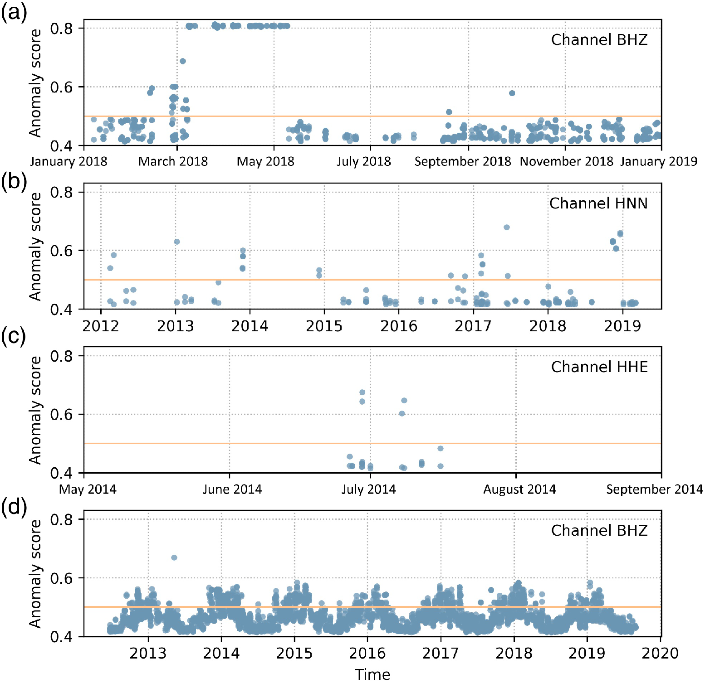
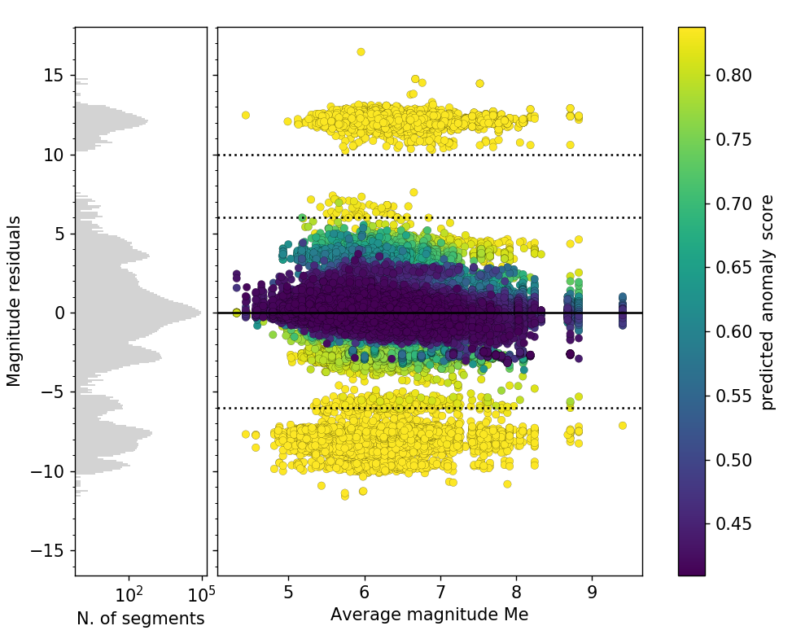
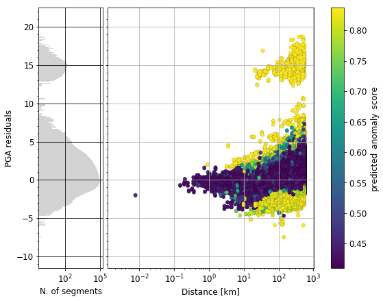

# sdaas

|Jump to: | [Citation](#citation) | [Installation](#installation) | [Usage](#usage) |
| - | - | - | - |

<!-- **S**eismic **D**ata (and metadata) **A**mplitude **A**nomaly **S**core -->



Simple, general and flexible tool for the identification of anomalies in 
seismic waveform amplitude, e.g.:
 - recording artifacts (e.g., anomalous noise, peaks, gaps, spikes)
 - sensor problems (e.g. digitizer noise)
 - metadata field errors (e.g. wrong stage gain in StationXML)

**For any waveform analyzed, the program computes an amplitude anomaly 
score in [0, 1] representing 
the degree of belief of a waveform to be an outlier**. The score
can be used:
 - in any processing pipeline to
   - pre-filter malformed data via a user-defined threshold
   - assign robustness weights
 - as station installation / metadata checker, leveraging the scores
   temporal trends (see e.g., figure 1st row)

Notes:

This program uses a machine learning algorithm specifically designed
for outlier detection (Isolation forest) where

  - scores <= 0.5 can be safely interpreted in all 
    applications as "no significant anomaly", with no distinction
    on the actual score value.
  - extreme score values are virtually impossible [by design](https://scikit-learn.org/stable/modules/calibration.html).
    This has to be considered when setting
    a user defined threshold T to discard malformed waveforms. In many application, setting T between 0.7 and 0.75 has proven
    to be a good compromise between [precision and recall (F1 score)](https://scikit-learn.org/stable/modules/model_evaluation.html#precision-recall-f-measure-metrics).

<!--


Simple program to compute amplitude anomaly scores (in [0, 1]) of seismic 
data and metadata.
Given a set of waveforms and their metadata, it removes the waveform response
and returns the anomaly score of the waveforms amplitudes.

This program can be used to filter out a set of malformed waveforms,
assign robustness weights
or to check the correctness of the metadata fields (e.g. Station inventory xml)
by checking the anomaly score on a set of station recordings. 
-->

## Citation

Riccardo Zaccarelli, Dino Bindi, Angelo Strollo; Anomaly Detection in Seismic Data–Metadata Using Simple Machine‐Learning Models. Seismological Research Letters 2021;; 92 (4): 2627–2639. doi: https://doi.org/10.1785/0220200339


## Installation

Always work within a virtual environment. From a terminal, in the directory
where you cloned this repository (last argument of `git clone`),

1. create a virtual environment (once). **Be sure you use Python>=3.7 (Type `python3 --version` to check)**:

    ```bash
    python3 -m venv .env
    ```

2. activate it (**to be done also every time you use this program**):
    ```bash
    source .env/bin/activate
    ```
   (then to deactivate, simply type ... `deactivate` on the terminal). 

3. Install the program (one line command):

    with [requirements file](https://pip.pypa.io/en/stable/user_guide/#requirements-files):
    ```
    pip install --upgrade pip setuptools && pip install -r ./requirements.txt && pip install -e .
    ```
    
    or standard (use this mainly if you install sdaas on an already existing virtualenv
    and you are concerned about breaking existing code):
    
    ```
    pip install --upgrade pip setuptools && pip install "numpy>=1.15.4" && pip install -e .
    ```
    
    Notes:
    
    - The "standard" install actually checks the `setup.py` file 
      and avoids overwriting libraries already matching the required version. The downside is
      that you might use library version that were not tested
    
    - `-e` is optional. With -e, you can update the installed program to the latest release
      by simply issuing a `git pull`
      
    - although used to train, test and generate the underlying model,
      `scikit learn` is not required for Security & maintainability 
      limitations. If you want to install it, type 
      `pip install scikit-learn>=0.21.3` or, in the
      standard installation you can include scikit learn
      with `pip install .[dev]` instead of `pip install .`

      <details>
      <summary>Reported scikit learn installation problems (click for details)</summary>
      
      Due to the specific version to be installed,
      scikit might have problems installing. 
      
      Few hints here:
      - you might need to preinstall `cython` (`pip install cython`)
      - you might need to `brew install libomp`, set the follwing env variables:
        ```
        export CC=/usr/bin/clang;export CXX=/usr/bin/clang++;export CPPFLAGS="$CPPFLAGS -Xpreprocessor -fopenmp";export CFLAGS="$CFLAGS -I/usr/local/opt/libomp/include";export CXXFLAGS="$CXXFLAGS -I/usr/local/opt/libomp/include";export LDFLAGS="$LDFLAGS -Wl,-rpath,/usr/local/opt/libomp/lib -L/usr/local/opt/libomp/lib -lomp"
        ```
      - and then install with the following flags:
        ```
        pip install --verbose --no-build-isolation "scikit-learn==0.21.3"
        ```
      
      **(For any further detail, see
      [scikit-learn installation page](https://scikit-learn.org/dev/developers/advanced_installation.html))**
      
      </details>

#### Run tests (optional)

```bash
python -m unittest -fv
```

(`-f` is optional and means: stop at first failure, `-v`: verbose)


## Usage

### As command line application

After activating your virtual environment (see above) you can access the program as
command line application in your terminal by typing `sdaas`. The application
can compute the score(s) of a single miniSEED file, a directory of miniSEED files, or 
a FDSN url ([dataselect or station](https://www.fdsn.org/webservices/) url).

**Please type `sdaas --help` for details and usages not covered in the examples below**


**Examples**

Compute scores from randomly selected segments of a given station and channel

```bash
>>> sdaas "http://geofon.gfz-potsdam.de/fdsnws/station/1/query?net=GE&sta=EIL&cha=BH?&start=2019-01-01" -v
[███████████████████████████████████████████████████████████████]  100%  0d 00:00:00
Output columns: | waveform_id | waveform_start | waveform_end | anomaly_score |
GE.EIL..BHN    2019-07-26T05:01:45  2019-07-26T05:04:20  0.45
GE.EIL..BHE    2019-07-26T05:01:54  2019-07-26T05:04:10  0.43
GE.EIL..BHZ    2019-07-26T05:01:57  2019-07-26T05:04:10  0.43
GE.EIL..BHN    2019-11-23T17:49:44  2019-11-23T17:52:00  0.83
GE.EIL..BHE    2019-11-23T17:49:36  2019-11-23T17:52:28  0.83
GE.EIL..BHZ    2019-11-23T17:49:59  2019-11-23T17:52:16  0.66
```
*(notes: when providing a station url, as in the example above, the only required query argument is `net`/`network`.
The paremeter `-v` / verbose prints additional info before the scores table)*

Same as above, but provide also a user-defined threshold (parameter `-th`),
which will also add an additional last column "anomaly" denoting the class label (1:outlier, 0:inlier)

```bash
>>> sdaas "http://geofon.gfz-potsdam.de/fdsnws/station/1/query?net=GE&sta=EIL&cha=BH?&start=2019-01-01" -v -th 0.7
[███████████████████████████████████████████████████████████████]  100%  0d 00:00:00
Output columns: | waveform_id | waveform_start | waveform_end | anomaly_score | anomaly |
GE.EIL..BHN    2019-07-26T05:01:45  2019-07-26T05:04:20  0.45  0
GE.EIL..BHE    2019-07-26T05:01:54  2019-07-26T05:04:10  0.43  0
GE.EIL..BHZ    2019-07-26T05:01:57  2019-07-26T05:04:10  0.43  0
GE.EIL..BHN    2019-11-23T17:49:44  2019-11-23T17:52:00  0.83  1
GE.EIL..BHE    2019-11-23T17:49:36  2019-11-23T17:52:28  0.83  1
GE.EIL..BHZ    2019-11-23T17:49:59  2019-11-23T17:52:16  0.66  1
```

Same as the first example, but compute and return the score median (on a channel base):

```bash
>>> sdaas "http://geofon.gfz-potsdam.de/fdsnws/station/1/query?net=GE&sta=EIL&cha=BH?&start=2019-01-01" -v -agg median
[███████████████████████████████████████████████████████████████]  100%  0d 00:00:00
Output columns: | waveform_id | waveform_start | waveform_end | anomaly_score |
GE.EIL..BHN    2019-07-26T05:01:45  2019-11-23T17:52:00  0.62
GE.EIL..BHE    2019-07-26T05:01:54  2019-11-23T17:52:28  0.63
GE.EIL..BHZ    2019-07-26T05:01:57  2019-11-23T17:52:16  0.44
```

Same as above, but save the scores table to CSV via the parameter `-sep` and
`>` (normal redirection of the standard output `stdout` to file)

```bash
>>> sdaas "http://geofon.gfz-potsdam.de/fdsnws/station/1/query?net=GE&sta=EIL&cha=BH?&start=2019-01-01" -v -sep "," > /path/to/myfile.csv
[███████████████████████████████████████████████████████████████]  100%  0d 00:00:00
Output columns: | waveform_id | waveform_start | waveform_end | anomaly_score |
```
*(note: only the scores table is output to `stdout`. Everything else is printed to 
`stderr` and thus should still be visible on the terminal, as in the example above)*

### As library in your Python code

This software can also be used as library in Python code (e.g. Jupyter Notebook)
to work with [ObsPy](https://docs.obspy.org/) objects (ObsPy is already included in the installation):
assuming you have one or more [Stream](https://docs.obspy.org/packages/autogen/obspy.core.stream.Stream.html)
or [Trace](https://docs.obspy.org/packages/autogen/obspy.core.trace.Trace.html),
with relative [Inventory](https://docs.obspy.org/packages/obspy.core.inventory.html), then

<!-- IMPORTANT: -->
<!-- EACH "```python...```" code snippet is executed also in `test_and_create_code_snippet`
to check that it works. If you implement new snippets here, add them in the test file as wll
-->

Compute the scores in a stream or iterable of traces (e.g. list. tuple, generator),
returning the score of each Trace:

```python
from obspy.core.inventory.inventory import read_inventory
from obspy.core.stream import read

from sdaas.core import traces_scores

# Load a Stream object and its inventory
# (use as example the test directory of the package):
stream = read('./tests/data/GE.FLT1..HH?.mseed')
inventory = read_inventory('./tests/data/GE.FLT1.xml')

# Compute the Stream anomaly score (3 scores, one for each Trace):
output = traces_scores(stream, inventory)
```
Then `output` is:
```
[0.45729656,  0.45199387,  0.45113142]
```

Compute the scores in a stream or iterable of traces, getting also the traces id (by 
default the tuple `(seed_id, start, end)`, where seed_id is the 
[Trace SEED identifier](https://docs.obspy.org/packages/autogen/obspy.core.trace.Trace.get_id.html)):

```python
from obspy.core.inventory.inventory import read_inventory
from obspy.core.stream import read

from sdaas.core import traces_idscores

# Load a Stream object and its inventory
# (use as example the test directory of the package):
stream = read('./tests/data/GE.FLT1..HH?.mseed')
inventory = read_inventory('./tests/data/GE.FLT1.xml')

# Compute the Stream anomaly score:
output = traces_idscores(stream, inventory)
```
Then `output` is:
```
([('GE.FLT1..HHE', datetime.datetime(2011, 9, 3, 16, 38, 5, 550001), datetime.datetime(2011, 9, 3, 16, 42, 12, 50001)), ('GE.FLT1..HHN', datetime.datetime(2011, 9, 3, 16, 38, 5, 760000), datetime.datetime(2011, 9, 3, 16, 42, 9, 670000)), ('GE.FLT1..HHZ', datetime.datetime(2011, 9, 3, 16, 38, 8, 40000), datetime.datetime(2011, 9, 3, 16, 42, 9, 670000))], array([ 0.45729656,  0.45199387,  0.45113142]))
```

Same as above, with custom traces id (their SEED identifier only):

```python
from obspy.core.inventory.inventory import read_inventory
from obspy.core.stream import read

from sdaas.core import traces_idscores

# Load a Stream object and its inventory
# (use as example the test directory of the package):
stream = read('./tests/data/GE.FLT1..HH?.mseed')
inventory = read_inventory('./tests/data/GE.FLT1.xml')

# Compute the Stream anomaly score:
output = traces_idscores(stream, inventory, idfunc=lambda t: t.get_id())
```
Then `output` is:
```
(['GE.FLT1..HHE', 'GE.FLT1..HHN', 'GE.FLT1..HHZ'], array([ 0.45729656,  0.45199387,  0.45113142]))
```

You can also compute scores and ids from iterables of streams (e.g., when reading from files)...

```python
from sdaas.core import streams_scores
from sdaas.core import streams_idscores
```

... or from a single trace:

```python
from sdaas.core import trace_score
```

For instance, to compute the anomaly score of several streams
(for each stream and for each trace therein, return the trace anomaly score):

```python
from obspy.core.inventory.inventory import read_inventory
from obspy.core.stream import read

from sdaas.core import streams_scores

# Load a Stream objects and its inventory
# (use as example the test directory of the package
# and mock a list of streams by loading twice the same Stream):
streams = [read('./tests/data/GE.FLT1..HH?.mseed'),
           read('./tests/data/GE.FLT1..HH?.mseed')]
inventory = read_inventory('./tests/data/GE.FLT1.xml')

# Compute Streams scores:
output = streams_scores(streams, inventory)
```
Then `output` is:
```
[ 0.45729656  0.45199387  0.45113142  0.45729656  0.45199387  0.45113142]
```

Same as above, computing the features and the scores separately for more control:

```python
from obspy.core.inventory.inventory import read_inventory
from obspy.core.stream import read

from sdaas.core import trace_features, aa_scores

# Load a Stream object and its inventory
# (use as example the test directory of the package
# and mock a list of streams by loading twice the same Stream):
streams = [read('./tests/data/GE.FLT1..HH?.mseed'),
           read('./tests/data/GE.FLT1..HH?.mseed')]
inventory = read_inventory('./tests/data/GE.FLT1.xml')

# Compute Streams scores:
feats = []
for stream in streams:
    for trace in stream:
        feats.append(trace_features(trace, inventory))
output = aa_scores(feats)
```
Then `output` is:
```
[0.45729656, 0.45199387, 0.45113142, 0.45729656, 0.45199387, 0.45113142]
```

## For maintainers

Although scikit learn is not used anymore for
[maintainability limitations](https://scikit-learn.org/stable/model_persistence.html#security-maintainability-limitations), 
you can always consult the [README](./sdaas/core/models) 
explaining how to manage create new scikit-learn models.
